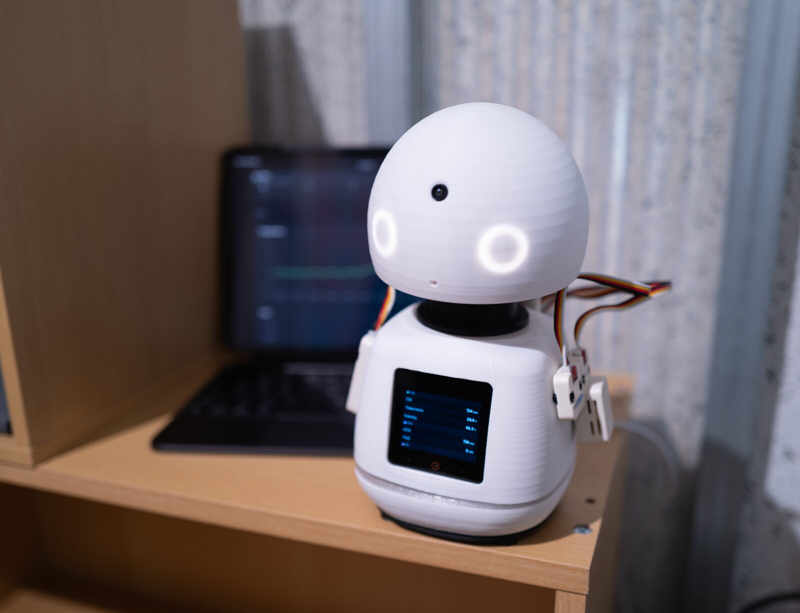
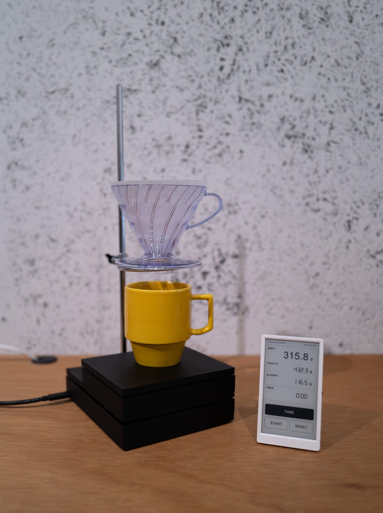
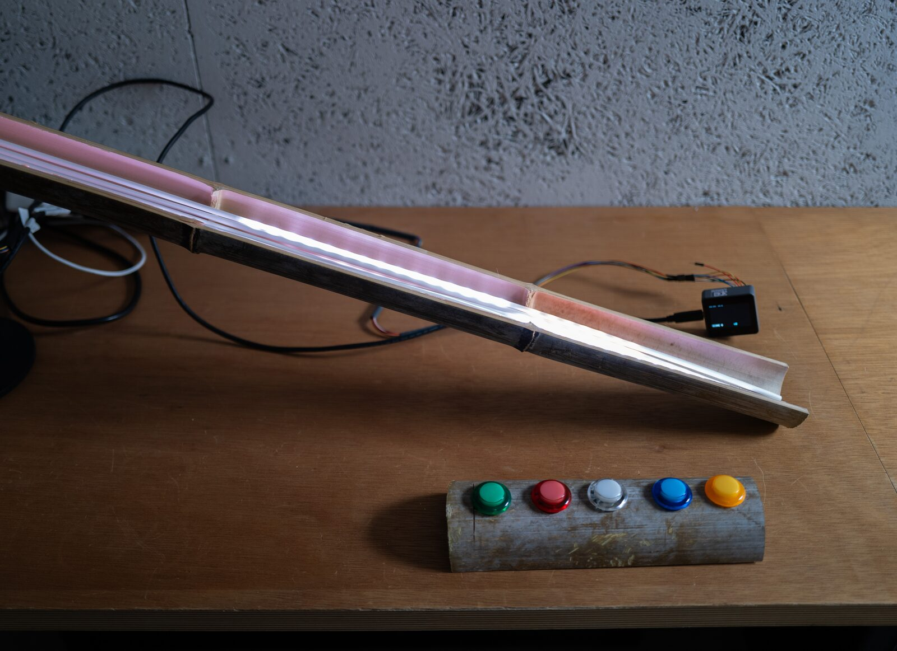
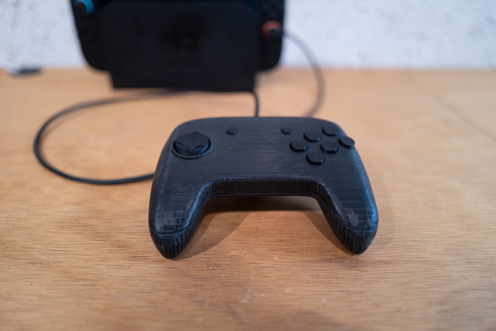
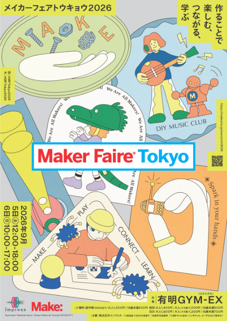

# Maker Faire Tokyo 2026

**2026.09.05 - 06** ・ Event

UNIBA GARAGE は、2026年9月5日(土)・6日(日)の2日間、有明GYM-EX で開催される Maker Faire Tokyo 2026 に「UNIBA / Garage」として出展します。ブースは **I-05-04**、カテゴリーは「クラフト」「企業内の部活動」です。

UNIBA の中に立ち上げた、新しいことに挑み夢中で取り組める場が Garage です。今回の展示では、Garage に集まったメンバーが、それぞれの興味や試行錯誤から生まれた作品を紹介します。

- [Maker Faire Tokyo 2026 イベント公式ページ](https://makezine.jp/event/mft2026/)
- [出展者ページ: UNIBA / Garage](https://makezine.jp/event/makers-mft2026/m0113/)

## 出展作品

### キーキャップジェネレーター

Webブラウザ上で動く、オリジナルのキーキャップを自由にデザインできる3Dデザインツール。生成したモデルデータを会場で3Dプリントし、来場者にプレゼントします。

### みまもりロボット

多種多様なセンサーで遠隔地の状況をみまもり、異常を検知して教えてくれるロボット。

### brewing-coffee.stream

ドリップコーヒーを淹れる様子を UDP でストリーミングするサービス。

### 名称未定（2点）

## 開催概要

- 日時: 2026年9月5日(土) 12:00～18:00 / 2026年9月6日(日) 10:00～17:00（入場は終了の30分前まで）
- 場所: 有明GYM-EX（ジメックス） 東京都江東区有明一丁目10番1号
- ブース: I-05-04（UNIBA / Garage）
- 入場料: 前売 大人1,400円・18歳未満500円 / 当日 大人1,800円・18歳未満700円（未就学児は無料）
- 主催: 株式会社インプレス

[← Home](/)
